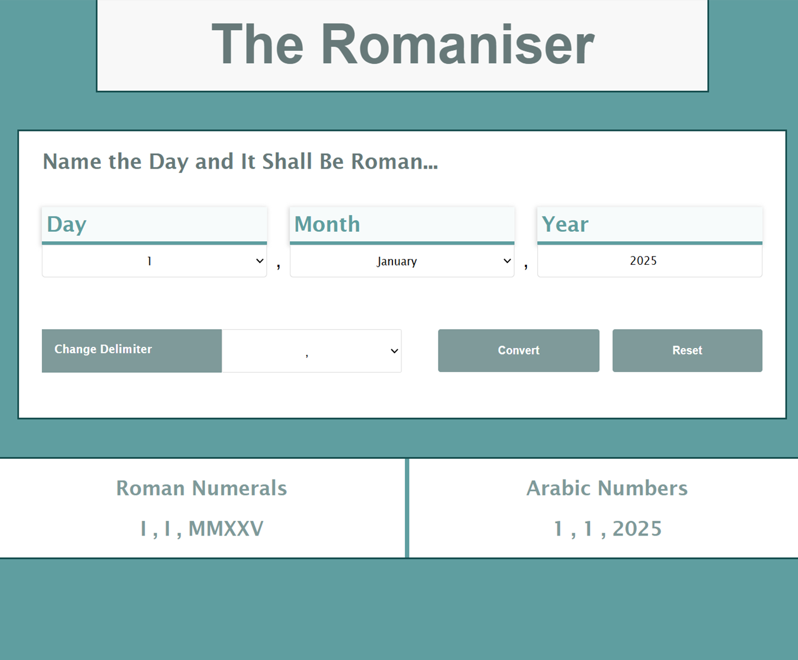

# Numbers to Numerals Converter

A responsive web tool that converts numbers into written numerals, featuring a clean and intuitive interface.

## Demo


## Features

- Converts numbers to written numerals instantly
- Gives the user delimiter options
- Clean, easy-to-read interface
- Responsive design for desktop and mobile

## Technologies Used

- HTML
- CSS
- JavaScript

## Installation / Usage

No installation required — simply open `index.html` in your browser to use the converter.

```bash
# Clone the repository
git clone https://github.com/yourusername/numbers-to-numerals.git

# Open the page in your browser
open index.html
```
## Authors

[Charlotte.D](https://github.com/C-Duberry)
